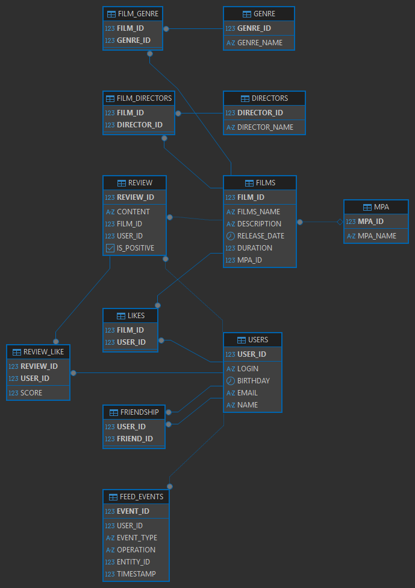

# java-filmorate
Template repository for Filmorate project.

1. Таблица users (Пользователи)
   Хранит информацию о зарегистрированных пользователях:

user_id - уникальный идентификатор (первичный ключ)

login - логин (обязательное поле)

birthday - дата рождения (обязательное поле)

email - электронная почта (обязательное поле, уникальное значение)

name - отображаемое имя пользователя (обязательное поле)

---
2. Таблица mpa (Рейтинги)
   Содержит возрастные рейтинги ассоциации кинокомпаний:

mpa_id - автоинкрементный идентификатор (первичный ключ)

name - название рейтинга (обязательное поле, уникальное значение)

---
3. Таблица films (Фильмы)
   Хранит информацию о кинокартинах:

film_id - уникальный идентификатор фильма (первичный ключ)

name - название (обязательное поле)

description - описание 

release_date - дата выхода (обязательное поле)

duration - длительность в минутах (обязательное поле)

mpa_id - ссылка на рейтинг из таблицы mpa (ограничение внешнего ключа)

---
4. Таблица friendship (Дружеские связи)
   Управляет отношениями между пользователями:

user_id - инициатор дружбы (внешний ключ на users.user_id)

friend_id - получатель запроса (внешний ключ на users.user_id)

status - статус (PENDING/CONFIRMED), по умолчанию PENDING

Первичный ключ: комбинация (user_id, friend_id)

Запрет самодружбы: user_id != friend_id

Каскадное удаление связей при удалении пользователя

---
5. Таблица genre (Жанры)
   Справочник киножанров:

genre_id - уникальный идентификатор жанра (первичный ключ)

name - название жанра (обязательное поле, уникальное значение)

---
6. Таблица film_genre (Связь фильмов и жанров)
   Реализация отношения многие-ко-многим между фильмами и жанрами:

film_id - идентификатор фильма (внешний ключ на films.film_id)

genre_id - идентификатор жанра (внешний ключ на genre.genre_id)

Первичный ключ: комбинация (film_id, genre_id)

Каскадное удаление при удалении фильма

---
7. Таблица likes (Лайки)
   Фиксирует оценки пользователей:

film_id - идентификатор фильма (внешний ключ на films.film_id)

user_id - идентификатор пользователя (внешний ключ на users.user_id)

Первичный ключ: комбинация (film_id, user_id)

Каскадное удаление при удалении фильма или пользователя

---
Ключевые особенности
Уникальные ограничения:

Единственность email (users.email)

Уникальные названия MPA-рейтингов (mpa.name) и жанров (genre.name)

Целостность данных:

Каскадное удаление зависимых записей (дружба, лайки, связи жанров)

Запрет удаления используемых MPA-рейтингов (ON DELETE RESTRICT)

Проверка допустимых значений статусов дружбы (CHECK)

Безопасность отношений:

Предотвращение циклических ссылок в дружбе

Защита от дублирования связей через составные первичные ключи

---
Примеры запросов:

Добавление нового пользователя:

INSERT INTO users (user_id, login, birthday, email, name)
VALUES (1, 'user_login', '1990-01-15', 'email@example.com', 'Username');

Обновление данных пользователя:

UPDATE users
SET name = 'New Name', birthday = '1995-05-20'
WHERE user_id = 1;

Получение всех пользователей:

SELECT user_id, login, birthday, email, name
FROM users;

Отправка запроса на дружбу:

INSERT INTO friendship (user_id, friend_id)
VALUES (1, 2);

Подтверждение дружбы:

UPDATE friendship
SET status = 'CONFIRMED'
WHERE user_id = 2 AND friend_id = 1;

Получение списка друзей пользователя:

SELECT u.user_id, u.name, u.email
FROM friendship f
JOIN users u ON f.friend_id = u.user_id
WHERE f.user_id = 1 AND f.status = 'CONFIRMED';

Добавление нового фильма:

INSERT INTO films (film_id, name, description, release_date, duration, mpa_id)
VALUES (101, 'Film Name', 'Film description', '2020-03-15', 120, 3);

Поиск фильмов по названию:

SELECT film_id, name, release_date
FROM films
WHERE name ILIKE '%film%';

Добавление лайка фильму:

INSERT INTO likes (film_id, user_id)
VALUES (101, 1);

Получение всех жанров:

SELECT genre_id, name
FROM genre
ORDER BY genre_id;

Добавление жанра к фильму:

INSERT INTO film_genre (film_id, genre_id)
VALUES (101, 5);

Получение жанров фильма:

SELECT g.name
FROM film_genre fg
JOIN genre g ON fg.genre_id = g.genre_id
WHERE film_id = 101;

Получение всех рейтингов:

SELECT mpa_id, name
FROM mpa;

Получение рейтинга для фильма:

SELECT m.name
FROM films f
JOIN mpa m ON f.mpa_id = m.mpa_id
WHERE film_id = 101;

Топ-5 популярных фильмов:

SELECT f.film_id, f.name, COUNT(l.user_id) AS likes_count
FROM films f
LEFT JOIN likes l ON f.film_id = l.film_id
GROUP BY f.film_id
ORDER BY likes_count DESC
LIMIT 5;

Общие друзья пользователей:

SELECT u.user_id, u.name
FROM friendship f1
JOIN friendship f2 ON f1.friend_id = f2.friend_id
JOIN users u ON f1.friend_id = u.user_id
WHERE f1.user_id = 1 AND f2.user_id = 3
AND f1.status = 'CONFIRMED' AND f2.status = 'CONFIRMED';